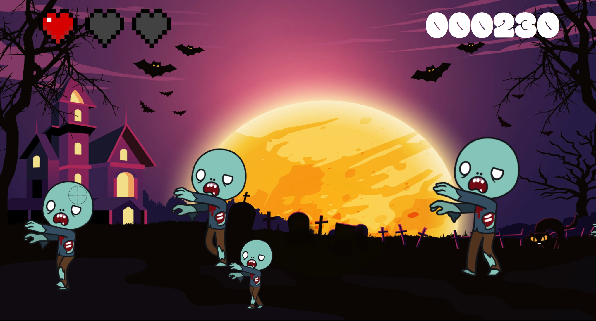

# Bookshop
   Trzy mikroserwisy zbudowane przy użyciu Node.js, Express i Sequelize w celu zarządzania książkami, zamówieniami i użytkownikami księgarni. Każda usługa działa niezależnie i łączy się z bazą danych SQLite.

# Zombie game
  Prosta gra przeglądarkowa, polegająca na strzelaniu do zombie, stworzona przede wszystkim z wykorzystaniem JavaScript.

  

    
  

# Prosta strona statyczna
  Pierwsze zadanie polegające na stworzeniu strony o dowolnej tematyce przy uzyciu HTML i CSS. 

  
  

